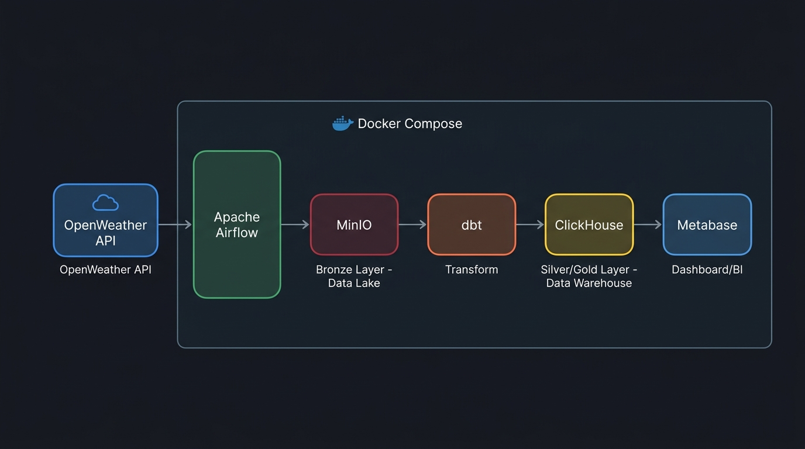

# 🌦️ OpenWeather API — End-to-End Data Pipeline

A fully containerized **ELT data pipeline** that extracts real-time weather data from the OpenWeather API, stores raw JSON in a MinIO data lake (Bronze Layer), transforms it with dbt into ClickHouse (Silver/Gold Layer), and visualizes insights through Metabase — all orchestrated by Apache Airflow.

## 📐 Architecture



| Layer | Tool | Role |
|---|---|---|
| **Ingestion** | OpenWeather API | Real-time weather data source |
| **Orchestration** | Apache Airflow | Schedule & monitor the pipeline |
| **Bronze (Raw)** | MinIO (S3-compatible) | Store raw JSON files |
| **Transform** | dbt | Clean & aggregate data |
| **Silver / Gold** | ClickHouse | Columnar data warehouse |
| **BI / Dashboard** | Metabase | Data visualization |
| **Infrastructure** | Docker Compose | One-command deployment |

---

## 🔄 Pipeline Flow

```
OpenWeather API
      │
      ▼
┌─────────────────────────────────────────────────┐
│  Airflow DAG: weather_api_to_minio_pipeline     │
│                                                 │
│  Task 1: fetch_and_upload_weather               │
│  ├── Call OpenWeather API for 5 cities           │
│  └── Upload JSON → MinIO (Bronze Layer)         │
│           │                                     │
│           ▼                                     │
│  Task 2: run_dbt_models                         │
│  ├── stg_weather    → Read from MinIO (S3)      │
│  └── mart_weather_daily → Aggregate by day/city │
│           │                                     │
│           ▼                                     │
│       ClickHouse (Silver/Gold Layer)            │
└─────────────────────────────────────────────────┘
      │
      ▼
   Metabase (Dashboard)
```

---

## 🏙️ Supported Cities

| City | Country |
|---|---|
| Bangkok | Thailand |
| Chiang Mai | Thailand |
| Phrae | Thailand |
| Nakhon Ratchasima | Thailand |
| Phuket | Thailand |

---

## 🗂️ Project Structure

```
openweather_api_pipeline/
├── dags/
│   └── weather_etl_dag.py        # Airflow DAG definition
├── dbt_weather/
│   ├── models/
│   │   ├── stg_weather.sql        # Staging: raw JSON → structured table
│   │   └── mart_weather_daily.sql # Mart: daily aggregation per city
│   ├── profiles.yml               # dbt connection config (ClickHouse)
│   └── dbt_project.yml            # dbt project config
├── docs/
│   └── architecture.jpg           # Architecture diagram
├── plugins/                       # Airflow custom plugins (empty)
├── .env                           # Environment variables (not in git)
├── .gitignore
├── Dockerfile                     # Custom Airflow image
├── docker-compose.yml             # Full stack infrastructure
├── requirements.txt               # Python dependencies
└── README.md
```

---

## 🛠️ Tech Stack

| Technology | Version | Purpose |
|---|---|---|
| **Apache Airflow** | 2.8.1 | Workflow orchestration |
| **MinIO** | Latest | S3-compatible object storage (Data Lake) |
| **ClickHouse** | Latest | Columnar OLAP database (Data Warehouse) |
| **dbt** | 1.11+ | Data transformation (ELT) |
| **Metabase** | Latest | Business Intelligence dashboard |
| **PostgreSQL** | 13 | Airflow metadata database |
| **Docker Compose** | 3.8 | Container orchestration |
| **Python** | 3.10 | DAG & extraction logic |

---

## ⚡ Quick Start

### Prerequisites

- [Docker](https://docs.docker.com/get-docker/) & [Docker Compose](https://docs.docker.com/compose/install/)
- [OpenWeather API Key](https://openweathermap.org/api) (free tier)

### 1. Clone the repository

```bash
git clone https://github.com/<your-username>/openweather_api_pipeline.git
cd openweather_api_pipeline
```

### 2. Configure environment variables

Create a `.env` file in the project root:

```env
WEATHER_API_KEY=<your_openweather_api_key>

MINIO_ENDPOINT=http://minio:9000
MINIO_ACCESS_KEY=admin
MINIO_SECRET_KEY=password123
MINIO_BUCKET_NAME=weather-raw-data
```

### 3. Start all services

```bash
docker-compose up -d
```

### 4. Access the services

| Service | URL | Credentials |
|---|---|---|
| **Airflow** | [http://localhost:8080](http://localhost:8080) | `admin` / `admin` |
| **MinIO Console** | [http://localhost:9001](http://localhost:9001) | `admin` / `password123` |
| **ClickHouse** | [http://localhost:8123](http://localhost:8123) | `admin` / `admin` |
| **Metabase** | [http://localhost:3000](http://localhost:3000) | Setup on first launch |

### 5. Trigger the pipeline

1. Open Airflow at `http://localhost:8080`
2. Enable the DAG **`weather_api_to_minio_pipeline`**
3. Click **Trigger DAG** ▶️
4. Monitor task progress in the Graph view

---

## 📊 dbt Models

### `stg_weather` — Staging Layer

Reads raw JSON directly from MinIO using ClickHouse's S3 table function and extracts structured columns.

| Column | Type | Description |
|---|---|---|
| `city_name` | String | City name |
| `temperature` | Float | Temperature in °C |
| `humidity` | Float | Humidity percentage |
| `weather_condition` | String | Weather condition (e.g., Clouds, Rain) |
| `ingestion_date` | Date | Date the data was ingested |

### `mart_weather_daily` — Mart Layer

Aggregates staging data by city and date for daily weather summaries.

| Column | Type | Description |
|---|---|---|
| `ingestion_date` | Date | Date |
| `city_name` | String | City name |
| `avg_temperature` | Float | Average temperature (°C) |
| `avg_humidity` | Float | Average humidity (%) |
| `primary_weather` | String | Primary weather condition |

---

## 🔍 Example Queries (ClickHouse)

```sql
-- View all weather data
SELECT * FROM weather_db.stg_weather ORDER BY ingestion_date DESC;

-- Daily summary by city
SELECT * FROM weather_db.mart_weather_daily ORDER BY ingestion_date DESC;

-- Hottest city today
SELECT city_name, avg_temperature
FROM weather_db.mart_weather_daily
WHERE ingestion_date = today()
ORDER BY avg_temperature DESC
LIMIT 1;
```

---

## 🐳 Docker Services Overview

```
docker-compose.yml
├── postgres          → Airflow metadata DB
├── minio             → Object storage (Bronze Layer)
├── minio-setup       → Auto-create bucket on startup
├── clickhouse        → Data warehouse (Silver/Gold)
├── airflow-init      → Initialize Airflow DB & admin user
├── airflow-webserver → Airflow UI (port 8080)
├── airflow-scheduler → DAG scheduler
└── metabase          → BI dashboard (port 3000)
```

---

## 📝 License

This project is for educational and portfolio purposes.

---

## 🙋 Author

Built as a hands-on Data Engineering portfolio project demonstrating a modern ELT pipeline with open-source tools.
